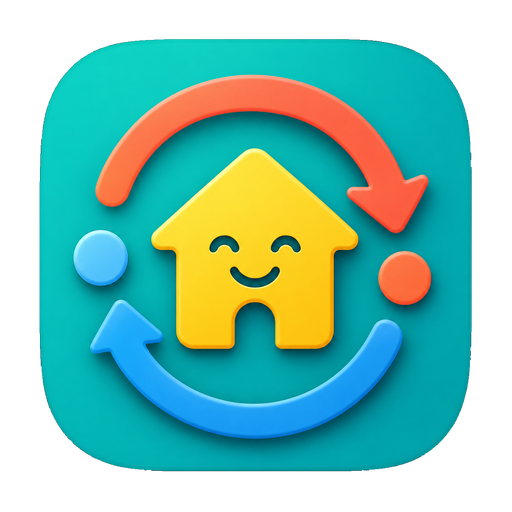

<p align="center">
  
</p>

# Domoticz Sync for Home Assistant

[](https://github.com/adrighem/ha-domoticz-sync/actions/workflows/ci.yml)
[](https://github.com/adrighem/ha-domoticz-sync/actions/workflows/codeql.yml)

This custom integration imports device state from Domoticz into Home Assistant
using the Domoticz JSON API. Its companion plugin can also export selected
Home Assistant numeric sensors to Domoticz.

The entities imported from Domoticz are intentionally read-only:

- Polls `/json.htm?type=command&param=getdevices&filter=all&used=true&order=Name`
- Creates Home Assistant sensors for typed Domoticz values such as temperature, humidity, pressure, power, counters, rain, wind, battery, and text values
- Creates read-only binary sensors for Domoticz switch/security states such as motion, door contact, smoke, moisture, and on/off switches
- Supports username/password Basic Auth
- Supports hidden-device and favorite-only filters through the options flow
- Includes a Domoticz companion plugin that exports selected Home Assistant
  numeric sensor entities as Domoticz Custom Sensors.

## Installation

This integration is installed via **HACS (Home Assistant Community Store)** as a custom repository:

[](https://my.home-assistant.io/redirect/hacs_repository/?owner=adrighem&repository=ha-domoticz-sync&category=integration)

Alternatively, add it manually:

1. Open **HACS** in your Home Assistant interface.
2. Click the three dots `...` in the top-right corner and select **Custom repositories**.
3. Paste the URL of this repository (`https://github.com/adrighem/ha-domoticz-sync`) in the **Repository** field.
4. Select **Integration** as the **Category** and click **Add**.
5. Find **Domoticz Sync** in HACS, click **Download** in the bottom-right, and download the latest version.
6. **Restart Home Assistant** to load the custom component.
7. Go to **Settings** -> **Devices & Services** -> **Add Integration**, search for **Domoticz Sync**, and follow the configuration steps.

## Configuration

The setup flow asks for:

- **Domoticz URL**, for example `http://192.168.1.20:8080` or `https://xmpp.vanadrighem.eu:8443/domoticz`
- **Username and password**, if your Domoticz instance requires them
- **SSL verification** for HTTPS Domoticz installations

### Syncing Only Selected Devices (Recommended)

By default, if you log in with an administrator or generic user, **all** active devices in Domoticz will be synced to Home Assistant. 

To limit the sync to a specific list of devices, we highly recommend creating a dedicated user in Domoticz:
1. In your Domoticz web interface, go to **Setup** -> **Users** and add a new user.
2. Select the newly created user in the list and click the **Set Devices** button.
3. Explicitly add only the devices you want to make visible in Home Assistant.
4. During the integration setup in Home Assistant, enter this dedicated user's **Username** and **Password**.

### Options

After setup, you can configure the following options:

- **Include hidden devices**
- **Only import favorite devices**
- **Polling interval in seconds** (how often to fetch updates from Domoticz)

The same screen also shows the **Link ID** and **Pairing key** used by the
Domoticz companion plugin. The pairing key is generated by Home Assistant. It
is not your Home Assistant password or an access token, and should be kept
private.

## Domoticz Companion Plugin

The root-level `plugin.py` lets Domoticz make an outbound, authenticated
WebSocket connection to Home Assistant. When the plugin connects, Home
Assistant exports numeric sensor entities assigned the **Domoticz Export**
label. The plugin creates, adopts, or updates matching Domoticz Custom Sensors.
It uses deterministic device IDs, so reconnecting adopts the same devices
instead of creating duplicates. It never deletes Domoticz devices.

To select an entity for export in Home Assistant:

1. Go to **Settings** -> **Devices & services** -> **Entities**.
2. Open the entity.
3. Add **Domoticz Export** under **Labels** and save.

Export currently runs once when the Domoticz plugin connects. Restart the
plugin or Domoticz after changing an entity state or label. Binary entity
export and continuous state updates are planned for later. The plugin does not
yet inventory Domoticz devices, so it cannot detect every manual change made on
the Domoticz side. An unavailable Home Assistant entity marks its Domoticz
device as timed out for the current Domoticz runtime. That flag is not
persisted across a Domoticz restart. If the source remains unavailable, this
connect-time version may not reassert the unchanged flag until the source state
changes; full remote-state repair is planned for later.

Install the whole repository as one Domoticz plugin directory. The plugin uses
the shared neutral core shipped elsewhere in the repository, so copying only
`plugin.py` is not sufficient. The companion plugin and shared core support
Python 3.9 and newer. Install the tagged release matching the Home Assistant
integration rather than the moving `main` branch.

<!-- x-release-please-start-version -->
```bash
cd /path/to/domoticz/plugins
git clone --branch v0.2.0 https://github.com/adrighem/ha-domoticz-sync.git
```
<!-- x-release-please-end -->

Then:

1. Restart Domoticz.
2. In Home Assistant, go to **Settings** -> **Devices & Services** ->
   **Domoticz Sync** -> **Configure**.
3. Copy the displayed **Link ID** and **Pairing key**.
4. In Domoticz, go to **Setup** -> **Hardware** and add
   **Home Assistant Domoticz Sync**.
5. Enter the Home Assistant host without a scheme or path, its port, the
   connection type, and the copied credentials.

For a normal direct Home Assistant connection on a trusted LAN, use:

- Host: `homeassistant.local` or its local IP address
- Port: `8123`
- Connection: `WS`

For a TLS reverse proxy on a trusted network or VPN, use its host, port `443`,
and `WSS`.

The native Domoticz `WSS` transport encrypts against passive observation, but
it does not verify the Home Assistant certificate or hostname. An active
man-in-the-middle can relay the connection and read its traffic. Keep the
endpoint on a trusted LAN or VPN and do not expose it directly to the public
internet. Never include the pairing key in logs or issue reports. Pairing-key
rotation is not provided yet.

HACS updates the Home Assistant custom component. The checkout under the
Domoticz plugins directory must be updated and restarted separately:

<!-- x-release-please-start-version -->
```bash
cd /path/to/domoticz/plugins/ha-domoticz-sync
git fetch --tags
git checkout v0.2.0
# Restart Domoticz after the update.
```
<!-- x-release-please-end -->

## Development

Run tests from this folder:

```bash
python -m pytest
```

The parser and API client are split from Home Assistant entity code so support for more Domoticz device types can be added with focused tests.

Releases are managed by Release Please. Use Conventional Commit messages such as `fix:` and `feat:` for user-visible changes.

## Security

CodeQL, Dependency Review, pip-audit, and Dependabot are configured for this repository. Please report vulnerabilities privately through GitHub Security Advisories and do not include secrets in public issues.

## License

GPL-3.0-only. See [LICENSE](LICENSE).
